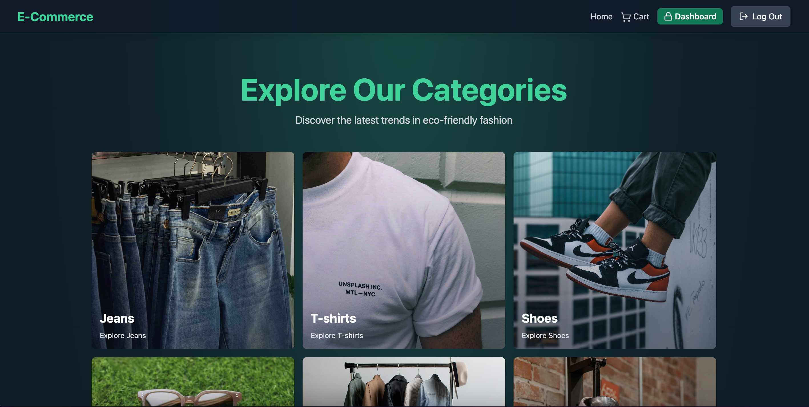
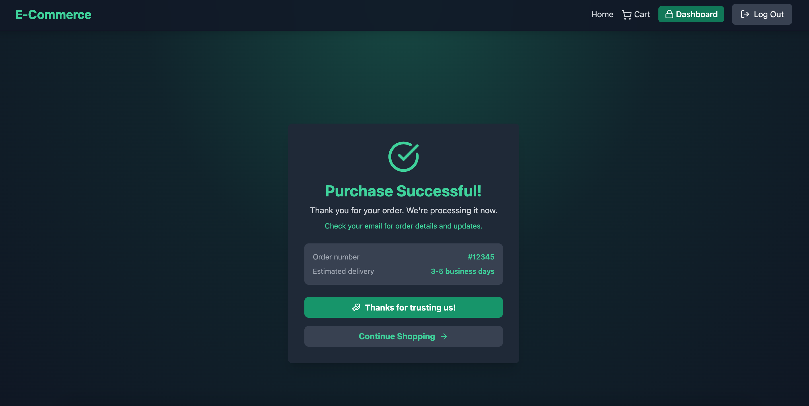

# E-Commerce Store

A modern, full-stack e-commerce application built with React and Node.js, featuring user authentication, product management, shopping cart, payment processing, and an admin dashboard with analytics.


## Screenshots

### Homepage

The homepage features a clean, modern design with category browsing and featured products.



**Key Features:**

- Category grid with visual cards (Jeans, T-shirts, Shoes, Glasses, Jackets, Suits, Bags)
- Featured products carousel showcasing highlighted items
- Intuitive navigation with cart badge showing item count
- Responsive design that works on all devices

### Category Pages

Browse products filtered by specific categories with detailed product information.


**Features:**

- Product grid layout with images, names, and prices
- "Add to Cart" functionality for each product
- Seamless navigation between categories

### Shopping Cart

Manage your cart items, apply coupons, and proceed to checkout.


**Features:**

- View all cart items with quantities
- Adjust item quantities with +/- buttons
- Remove items with trash icon
- Apply discount coupons
- View order summary with savings breakdown
- "People also bought" recommendations
- Direct checkout to Stripe payment

### Purchase Success

Confirmation page after successful payment processing.



**Information Displayed:**

- Order confirmation with order number
- Estimated delivery time
- Thank you message
- Options to continue shopping or view order details

### Admin Dashboard - Products Management

Admin interface for managing products, including creation, editing, and deletion.


**Features:**

- View all products in a table format
- See product images, names, prices, and categories
- Toggle featured status for products
- Delete products from inventory
- Create new products with image uploads

### Admin Dashboard - Analytics

Comprehensive analytics dashboard showing sales performance and key metrics.


**Key Metrics:**

- Total Users count
- Total Products in inventory
- Total Sales count
- Total Revenue generated
- Interactive charts showing revenue and sales trends over time
- Date-range analytics visualization

## Features

### Customer Features

- 🔐 **User Authentication** - Secure signup and login with JWT tokens
- 🛍️ **Product Browsing** - Browse products by category (Jeans, T-shirts, Shoes, Glasses, Jackets, Suits, Bags)
- ⭐ **Featured Products** - Highlighted featured products on the homepage
- 🛒 **Shopping Cart** - Add/remove items and manage cart quantities
- 💳 **Secure Payments** - Stripe integration for secure payment processing
- 🎫 **Coupon System** - Apply discount coupons at checkout
- 📱 **Responsive Design** - Beautiful, modern UI that works on all devices

### Admin Features

- 📦 **Product Management** - Create, view, and manage products
- 📊 **Analytics Dashboard** - View sales analytics and insights
- 🖼️ **Image Upload** - Upload product images via Cloudinary
- 👥 **User Management** - Admin-only dashboard access

## Tech Stack

### Frontend

- **React 19** - Modern React with latest features
- **Vite** - Fast build tool and dev server
- **Tailwind CSS** - Utility-first CSS framework
- **Zustand** - Lightweight state management
- **React Router** - Client-side routing
- **Stripe.js** - Payment processing
- **Framer Motion** - Smooth animations
- **Recharts** - Analytics charts
- **Axios** - HTTP client
- **React Hot Toast** - Toast notifications

### Backend

- **Express.js** - Web framework
- **MongoDB** - Database with Mongoose ODM
- **Redis** - Caching layer (Upstash)
- **JWT** - Authentication tokens
- **Stripe** - Payment processing
- **Cloudinary** - Image storage and management
- **Bcrypt** - Password hashing

## Prerequisites

Before you begin, ensure you have the following installed:

- **Node.js** (v18 or higher)
- **npm** or **yarn**
- **MongoDB** (local or MongoDB Atlas account)
- **Redis** (Upstash account recommended for cloud Redis)

## Installation

1. **Clone the repository**

   ```bash
   git clone <repository-url>
   cd E-Commerce-Store
   ```

2. **Install root dependencies**

   ```bash
   npm install
   ```

3. **Install frontend dependencies**
   ```bash
   cd frontend
   npm install
   cd ..
   ```

## Configuration

1. **Create a `.env` file in the root directory** with the following variables:

   ```env
   # Server Configuration
   PORT=5000

   # MongoDB
   MONGO_URI=your_mongodb_connection_string

   # JWT Secrets
   ACCESS_TOKEN_SECRET=your_access_token_secret
   REFRESH_TOKEN_SECRET=your_refresh_token_secret

   # Stripe
   STRIPE_SECRET_KEY=your_stripe_secret_key

   # Cloudinary
   CLOUDINARY_CLOUD_NAME=your_cloudinary_cloud_name
   CLOUDINARY_API_KEY=your_cloudinary_api_key
   CLOUDINARY_API_SECRET=your_cloudinary_api_secret

   # Redis (Upstash)
   UPSTASH_REDIS_URL=your_upstash_redis_url
   ```

2. **Get your API keys:**
   - **MongoDB**: Create a free cluster at [MongoDB Atlas](https://www.mongodb.com/cloud/atlas)
   - **Stripe**: Get your keys from [Stripe Dashboard](https://dashboard.stripe.com/apikeys)
   - **Cloudinary**: Sign up at [Cloudinary](https://cloudinary.com/users/register/free)
   - **Upstash Redis**: Create a free database at [Upstash](https://upstash.com/)
   - **JWT Secrets**: Generate secure random strings (use `openssl rand -base64 32`)

## Running the Application

### Development Mode

1. **Start the backend server**

   ```bash
   npm run dev
   ```

   The backend server will run on `http://localhost:5000`

2. **Start the frontend development server** (in a new terminal)
   ```bash
   cd frontend
   npm run dev
   ```
   The frontend will run on `http://localhost:5173` (or another port if 5173 is busy)

### Production Mode

1. **Build the frontend**

   ```bash
   npm run build
   ```

2. **Start the production server**
   ```bash
   npm start
   ```

## Project Structure

```
E-Commerce-Store/
├── backend/
│   ├── controllers/      # Request handlers
│   │   ├── analytics.controller.js
│   │   ├── auth.controller.js
│   │   ├── cart.controller.js
│   │   ├── coupon.controller.js
│   │   ├── payment.controller.js
│   │   └── product.controller.js
│   ├── lib/              # Utility libraries
│   │   ├── cloudinary.js
│   │   ├── db.js
│   │   ├── redis.js
│   │   └── stripe.js
│   ├── middleware/       # Express middleware
│   │   └── auth.middleware.js
│   ├── models/           # MongoDB models
│   │   ├── coupon.model.js
│   │   ├── order.model.js
│   │   ├── product.model.js
│   │   └── user.model.js
│   ├── routes/           # API routes
│   │   ├── analytics.route.js
│   │   ├── auth.route.js
│   │   ├── cart.route.js
│   │   ├── coupon.route.js
│   │   ├── payment.route.js
│   │   └── product.route.js
│   └── server.js         # Entry point
│
├── frontend/
│   ├── public/           # Static assets
│   ├── src/
│   │   ├── components/   # React components
│   │   ├── pages/        # Page components
│   │   ├── stores/       # Zustand stores
│   │   ├── lib/          # Frontend utilities
│   │   ├── App.jsx
│   │   └── main.jsx
│   ├── package.json
│   └── vite.config.js
│
├── screenshots/          # Application screenshots for documentation
│   └── README.md
│
└── package.json          # Root package.json
```

## API Endpoints

### Authentication

- `POST /api/auth/signup` - User registration
- `POST /api/auth/login` - User login
- `POST /api/auth/logout` - User logout
- `POST /api/auth/refresh` - Refresh access token

### Products

- `GET /api/products` - Get all products (with optional category filter)
- `GET /api/products/featured` - Get featured products
- `POST /api/products` - Create a new product (admin only)
- `PUT /api/products/:id` - Update a product (admin only)
- `DELETE /api/products/:id` - Delete a product (admin only)

### Cart

- `GET /api/cart` - Get user's cart items
- `POST /api/cart` - Add item to cart
- `PUT /api/cart/:id` - Update cart item quantity
- `DELETE /api/cart/:id` - Remove item from cart

### Coupons

- `GET /api/coupons` - Get all coupons
- `POST /api/coupons` - Create a coupon (admin only)

### Payments

- `POST /api/payments/create-checkout-session` - Create Stripe checkout session

### Analytics

- `GET /api/analytics` - Get analytics data (admin only)

## Usage

### As a Customer

1. **Sign up** for a new account or **log in** if you already have one
2. **Browse products** by category on the homepage
3. **View products** in each category page
4. **Add items** to your cart
5. **Apply coupons** (if available) at checkout
6. **Complete purchase** using Stripe payment

### As an Admin

1. **Log in** with an admin account
2. **Access the admin dashboard** at `/secret-dashboard`
3. **Create products** with images, descriptions, and prices
4. **View analytics** to track sales and performance
5. **Manage products** from the products list

## Security Features

- 🔒 JWT-based authentication with access and refresh tokens
- 🔐 Password hashing with bcrypt
- 🛡️ Protected routes with authentication middleware
- 👑 Role-based access control (admin/user)
- 🍪 Secure cookie handling for tokens

## Performance Optimizations

- ⚡ Redis caching for featured products
- 🚀 Vite for fast development and optimized builds
- 📦 Code splitting and lazy loading
- 🎯 Efficient database queries with Mongoose

## Contributing

Contributions are welcome! Please feel free to submit a Pull Request.

## License

This project is licensed under the ISC License.

## Support

For support, please open an issue in the repository or contact the development team.

---

Built with ❤️ using React and Node.js
